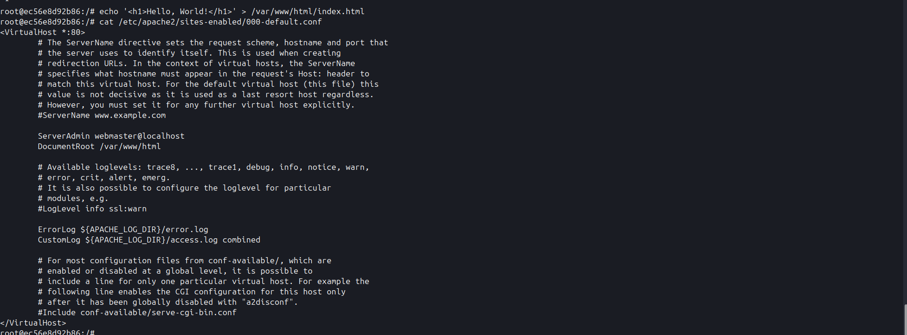

# Лабораторная работа: Инструменты Docker и ОС Ubuntu

**Цель работы:** Ознакомление с базовыми командами Docker, управление контейнерами и настройка веб-сервера Apache в среде Ubuntu.

**Задание:** Запустить контейнер Ubuntu, установить Apache и вывести страницу "Hello, World!".

---

## Выполнение работы

### 1. Запуск контейнера
Для запуска использовалась команда:
`docker run -ti -p 8000:80 --name containers04 ubuntu bash`

**Назначение флагов:**
* `-ti` — интерактивный режим с доступом к терминалу.
* `-p 8000:80` — проброс порта 80 из контейнера на порт 8000 хоста.
* `--name containers04` — имя контейнера.

### 2. Установка ПО внутри контейнера
Последовательно выполнены команды:
1. `apt update` — обновление списков пакетов.
2. `apt install apache2 -y` — установка веб-сервера.
3. `service apache2 start` — запуск службы Apache.

**Результат:** При переходе на `http://localhost:8000` отобразилась стандартная страница Apache2.

### 3. Изменение контента
Выполнена замена индексной страницы:
`echo '<h1>Hello, World!</h1>' > /var/www/html/index.html`

**Результат:** После обновления страницы в браузере отобразился текст "Hello, World!".

### 4. Анализ конфигурации
Команда: `cat /etc/apache2/sites-enabled/000-default.conf`

**Вывод:** В файле видна настройка `<VirtualHost *:80>` и параметр `DocumentRoot /var/www/html`, который указывает на корень веб-документов.

### 5. Завершение работы
После выхода из контейнера выполнено удаление:
1. `docker ps -a` — проверка статуса.
2. `docker rm containers04` — удаление контейнера.

---

## Выводы
В ходе работы были изучены команды жизненного цикла контейнера (`run`, `ps`, `rm`), а также принципы проброса портов. Успешно настроен веб-сервер внутри изолированной среды Docker.